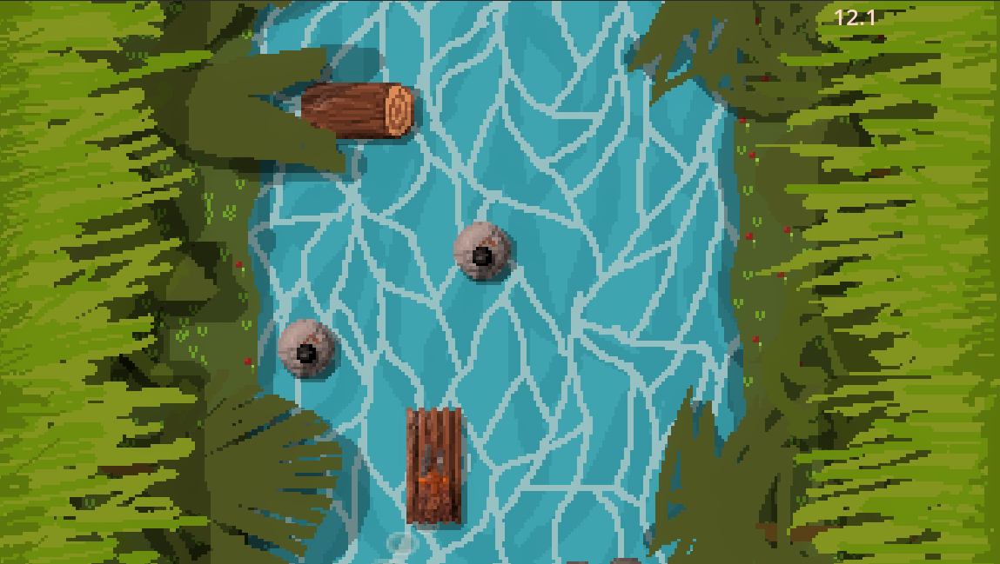

# MeowGame!

MeowGame! is a WarioWare style game featuring seven minigames.

## Game Rules:
The minigames must be completed within a certain timeframe.
Failure to do so will result in losing one life. The player is given five lives in total.

## Mingames:
- Platformer
- Clicker Game
- Flappy Bird
- Collect Fruit
- Jump over obstacles
- Doodle Jump
- Maneuver a raft

## Why I chose this project:
I always wanted to do something with game development. 
This Stardance mission was perfect for that.

## What I learned:
- How Godot works (the basics)
- Basic GDscript skills
- How to create pixel art for games

## Credits
Art is created by me
BGM: Audio from opengameart.org by mrpoly
Some water sound I found online